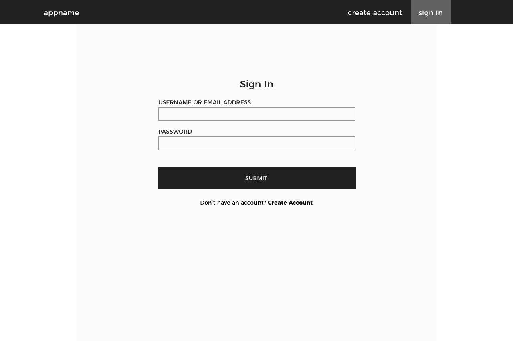
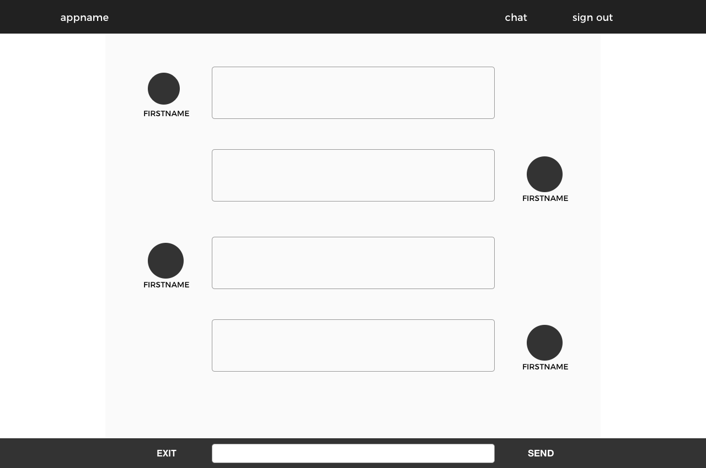
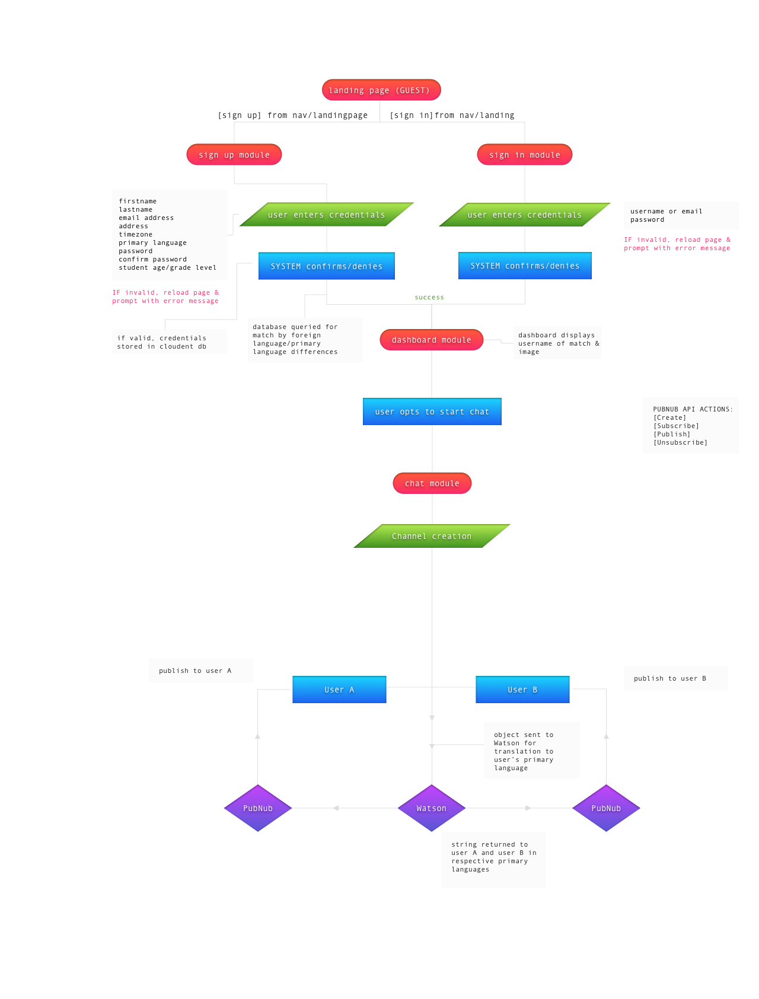

# Mobile Monday Hackathon

## IntlPenPals
IntlPenPals is a web application for global cultural exchange across languages. Classroom teachers register as users and are matched, as digital pen pals, with a classroom across the world; allowing students from different countries to communicate even when they speak different languages.

## USER STORIES
Definitions: 
1. User: Anyone who is accessing the platform
2. Guest: A user that is not signed in to the platform
3. Member: A user that is signed into the platform
4. System: The set of business logic that defines the platform
5. Teacher: A member with special priveleges
6. Student: A member with standard priveleges (post-mvp)
Stories:
1. As a **USER**, I can visit the homepage so that I can learn about the product
2. As a **GUEST**, that is viewing the homepage, I can opt to sign up or sign in from the homepage
3. As a **MEMBER**, that is viewing the homepage, I can opt to enter a chat or sign out
4. As a **GUEST**, I can input the necessary credentials to create an account as a **TEACHER**:
    - firstname
    - lastname
    - email address
    - address
    - timezone
    - primary language
    - password
    - confirm password
    - student age/grade level
5. As a **GUEST**, I can input the necessary credentials to sign in as a **TEACHER**
    - email address/username
    - password
6. As a **SYSTEM**, I can confirm or deny the user's sign-in credentials
    - if success, return success message and send to member homepage
    - if failure, reload page sign in with error message
7. As a **SYSTEM**, I can confirm or deny the user's sign-up credentials
8. As a **TEACHER**, I can select the 'enter chat' option from the homepage, which brings me to a form
9. As a **TEACHER**, I can enter my chat key into the form
10. As a **SYSTEM**, I can subscribe the user to the correct channel if their key is valid and load the `chat feature` component
11. As a **SYSTEM**, I can return an error message and reload the component is their key is invalid
12. As a **TEACHER** I can see the username, firstname, and last initial of the other teacher in the channel
13. As a **TEACHER** I can unsubscribe from the channel by selecting the 'exit' option
14. As a **TEACHER**, I can publish to the channel by writing a message in the text box and selecting 'submit'
15. As a **TEACHER**, I can view messages left by the other member of the chat 
16. As a **MEMBER**, I can opt to sign out from the navbar
17. As a **MEMBER**, I can confirm that I want to sign out
18. As a **SYSTEM**, I can sign the user out

## WIREFRAMES

## SYSTEM/ APP FLOW

## TECHNOLOGIES USED:

### Core Stack:

- React
- Node
- Loopback
- HTML
- CSS
- JavaScript
- Heroku
- Git
- Pubnub

### Middleware:

- Axios
- React-router-dom
- Cors
- CSS Frameworks

### APIs:

- LoopBack API
- IBM Watson API
- Cloudant API
- Google Maps API

### LoopBack API with Cloudant Database: http://penpal.mybluemix.net/explorer/#!/teacher/

